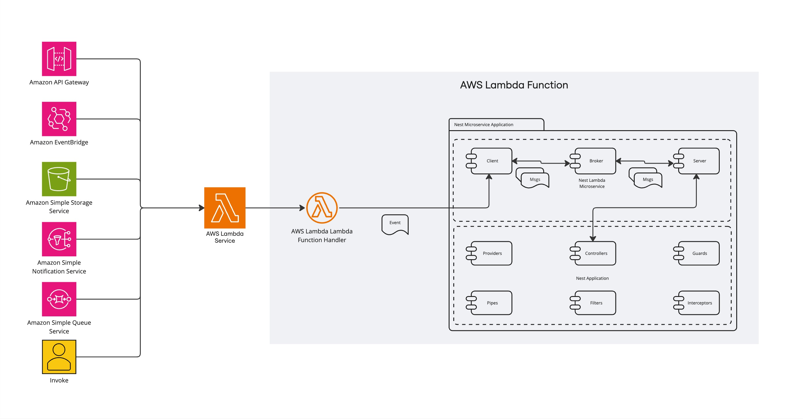

# Nest Lambda Microservice
[](https://github.com/klarna-incubator/nest-lambda-microservice/actions/workflows/main.yml)
[![Build Status][ci-image]][ci-url]
[![License][license-image]][license-url]
[![Developed at Klarna][klarna-image]][klarna-url]

> Custom transporter implementation for running NestJS based applications on AWS Lambda.



The **Nest Lambda Microservice** is a custom [NestJS transporter](https://docs.nestjs.com/microservices/custom-transport) solution that enables writing NestJS applications to process events on [AWS Lambda](https://docs.aws.amazon.com/lambda/latest/dg/lambda-nodejs.html).

# Table of contents
- [Overview](#overview)
- [Pattern Matching](#pattern-matching)
- [Message Processing](#message-processing)
- [Release History](#release-history)
- [License](#license)

## Overview
In addition to the traditional HTTP style architecture, NestJS framework support writing microservice applications that use transport layers other than HTTP.
This library implements a custom transporter for AWS Lambda, enabling NestJS applications running on AWS Lambda to process events from various sources (SNS, SQS, AWS Gateway, etc.) using all the concepts NestJS supports such as 
- [dependency injection](https://docs.nestjs.com/fundamentals/custom-providers)
- [decorators](https://docs.nestjs.com/custom-decorators)
- [exception filters](https://docs.nestjs.com/exception-filters)
- [pipes](https://docs.nestjs.com/pipes)
- [guards](https://docs.nestjs.com/guards)
- [interceptors](https://docs.nestjs.com/interceptors)

A Nest Lambda Microservice application is composed of a client, a broker and a server.

The client provider exposes a public method `processEvent(event: unknown, context: Context)` that is invoked by the Lambda handler.
Based on the event source, the event is mapped into one or multiple messages and published to the broker, e.g. an API Gateway event results in one message, but an SQS Event containing multiple Records, results in multiple messages published separately to the broker. 

The client awaits the processing of the messages and assembles a response to be returned by the Lambda handler based on the returned values from the handler that qualified and processed the message.

## Pattern Matching
To fulfill the NestJS microservice contract, the nest-lambda-microservice transporter implements the mapping of the incoming Lambda event to the NestJS microservice message pattern based on the Lambda event source.

### Full message pattern qualification
The message pattern is used to qualify a specific controller handler to process the event. The handler matching exactly the message pattern qualifies to process the message:
```typescript
@Controller()
export class Controller {
  @MessagePattern({ action: 'foo', resourceId: '1' }) 
  public processFoo() {}
}
```

### Partial message pattern qualification
By default, the Lambda microservice attempts to qualify the handler methods by performing a full match of the incoming message pattern and the handler pattern.
To allow partial pattern matches, one can provide the `partialMatch` option to the `MessagePattern` or mark the entire controller to use partial matches using the provided decorator.
```typescript
@Controller()
export class Controller {
  @MessagePattern({ action: 'foo' }, { partialMatch: true }) // Applies partial match on a specific handler only
  public processFoo() {}
}
```

```typescript
@UsePartialPatternMatch() // Applies partial match on all controller handlers
@Controller()
export class Controller {
  @MessagePattern({ action: 'foo' })
  public processFoo() {}
}
```

### Catch-all pattern
When no controller qualifies the message pattern, a lookup for a "catch-all" handler identified by `*` pattern qualifier is performed.
If no such handler is defined, the message is rejected and the Lambda event processing fails.

```typescript
@Controller()
export class Controller {
  @MessagePattern({ action: 'foo' }) // Qualifies messages with { action: 'foo' } patters 
  public processFoo() {}
  
  @MessagePattern('*') // Qualifies messages with patterns other than { action: 'foo' }
  public processBarBazAndCo() {}
}
```

## Message Processing
The Nest Lambda Microservice supports sync/async Request/Response message style (see more details on the [NestJS documentation](https://docs.nestjs.com/microservices/basics#request-response) page).

The two inputs into the Lambda function can be accessed in the NestJS application using the dependency injection:
```typescript
import { Controller } from '@nestjs/common'
import { Ctx, MessagePattern, Payload } from '@nestjs/microservices'
import { LambdaContext } from '@klarna/lambda-microservice'

@Controller()
export class Controller {
  @MessagePattern('*') 
  public processAnyMessage(
    @Payload() inboundMessage: unknown,
    @Ctx() context: LambdaContext 
  ) {
    console.log(inboundMessage) // The message as mapped from the input lambda event
    console.log(context.getLambdaInvocationContext()) // The Lambda function context object
  }
}
```

### API Gateway Event
The incoming API Gateway Event is mapped to the message pattern using the following logic:

```typescript
interface ApiGatewayPattern {
  httpMethod: string
  resource: string
  queryStringParameters: Record<string, unknown> | null
  pathParameters: Record<string, unknown> | null
}
```

The message payload is the original API Gateway event.

For more details see [this example](examples/api-gateway).

### Custom Request Event
The incoming custom event is any event used to manually invoke the AWS Lambda

```typescript
type CustomEventPattern = '*'
```

The message payload is the original payload the Lambda was invoked with.

For more details see [this example](examples/custom).

### Event Bridge Event
The incoming Event Bridge event is mapped to the message pattern using the following logic:

```typescript
interface EventBridgePattern {
  source: string
  detailType: string    // The Event Bridge event detail-type
  detail: JSONValue     // The Event Bridge event detail
}
```

The message payload is the original EventBridge event.

For more details see [this example](examples/event-bridge).

### S3 Event
The S3 event is mapped using the following logic:

```typescript
interface S3RecordPattern {
  eventName: string
  bucketName: string
  objectKey: string
}
```

The message payload is a Record from the original S3 event.

For more details see [this example](examples/s3).

### SNS Event
The SNS events are mapped using the event attributes

```typescript
interface SnsRecordPattern {
  [key: string]: string | number
}
```

The message payload is the SNSMessage.

For more details see [this example](examples/sns).

### SQS Event
The SQS events are mapped using the event attributes

```typescript
interface SqsRecordPattern {
  [key: string]: string | number
}
```

The message payload is a Record from the original SQS event.

For more details see [this example](examples/sqs).

## How to contribute

See our guide on [contributing](.github/CONTRIBUTING.md).

## Release History

See our [changelog](CHANGELOG.md).

## License

Copyright © 2024 Klarna Bank AB

For license details, see the [LICENSE](LICENSE) file in the root of this project.


<!-- Markdown link & img dfn's -->
[ci-image]: https://img.shields.io/badge/build-passing-brightgreen?style=flat-square
[ci-url]: https://github.com/klarna-incubator/TODO
[license-image]: https://img.shields.io/badge/license-Apache%202-blue?style=flat-square
[license-url]: http://www.apache.org/licenses/LICENSE-2.0
[klarna-image]: https://img.shields.io/badge/%20-Developed%20at%20Klarna-black?style=flat-square&labelColor=ffb3c7&logo=klarna&logoColor=black
[klarna-url]: https://klarna.github.io
